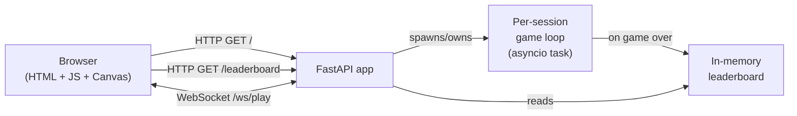
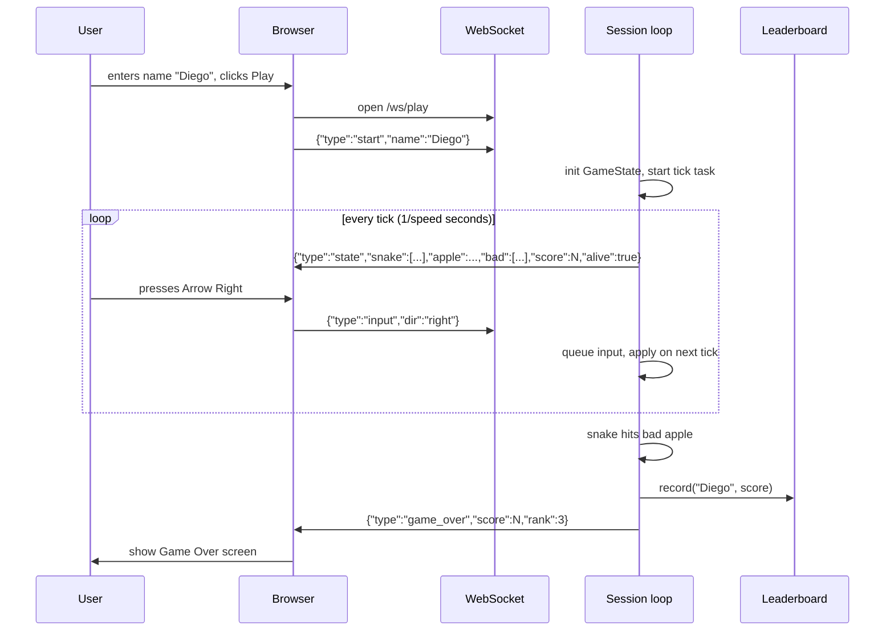

# Snake Game — Design Spec

**Date:** 2026-05-13
**Status:** Draft, pending user approval

## Goal

A browser-based, server-authoritative Snake game served by the existing FastAPI app. The player enters a name, plays single-player Snake with one good apple and two bad apples on the board, and on game over sees their score plus an in-memory leaderboard. Deployed automatically on Render (same as the current Hello World).

## Decisions (from brainstorming)

| Topic | Decision |
|---|---|
| Architecture | **Server-authoritative** via WebSocket. FastAPI runs the game loop; client renders. |
| Persistence | **In-memory leaderboard** on the server (top 10). Wiped on restart. |
| Bad apples | **2 on board always.** When a good apple is eaten, one bad apple is rerolled to a new random empty cell. |
| Walls | Snake **dies** on wall collision. |
| Self-collision | Snake **dies** on self collision. |
| Screen flow | Multi-screen SPA (Name / Play / Game Over / Leaderboard). **Nav available at all times**; navigating mid-game forfeits the round. |
| Grid | **30 × 30** cells. |
| Speed | Start **6 ticks/sec**, +10% every 5 apples, capped at **~14 ticks/sec**. |
| Controls | Arrow keys **and** WASD. **Space** = pause/resume. No mobile/touch (out of scope). |
| Visuals | **Modern minimal**: slate-900 background, lime snake, red good apple, dark-purple bad apple with an "X" mark, no grid lines, no sound. |
| Languages | **English, German, Spanish.** Language switcher visible on every screen. Default: browser locale (`navigator.language`) if it matches one of the supported languages, else English. Preference persisted in `localStorage`. |

## Architecture



**Why server-authoritative:** user preference. The server owns truth. Client is a thin renderer + input forwarder.

## Components

### Backend (`app/`)
A single FastAPI app, split into small modules so each file is focused:

- `app/main.py` — FastAPI app, route wiring, static + WebSocket mounts. Stays small.
- `app/game.py` — Pure game logic (no async, no network). `GameState` dataclass + `step(state, direction) -> StepResult`. Fully unit-testable.
- `app/session.py` — Per-WebSocket session. Owns one `GameState`, runs the asyncio tick loop, applies queued input, emits state messages, calls into `leaderboard` on game-over.
- `app/leaderboard.py` — In-memory top-10 store. Thread/async-safe via a single asyncio lock. Pure-Python list of `(name, score, timestamp)` sorted on insert.
- `app/schemas.py` — Pydantic models for WebSocket and HTTP messages.

### Frontend (`app/static/`)
- `app/static/index.html` — Single page hosting all four "screens" as sibling `<section>`s, only one visible at a time.
- `app/static/styles.css` — Modern-minimal theme (slate-900 bg, lime/red/purple accents, system font stack).
- `app/static/app.js` — Screen router (hash-based: `#/name`, `#/play`, `#/over`, `#/leaderboard`), name storage in `localStorage`, WebSocket client, canvas renderer, input handler.

### Tests (`tests/`)
- `tests/test_game.py` — Pure-logic tests for `game.py` (movement, collisions, apple spawning, speed-up curve, bad-apple rerolling).
- `tests/test_leaderboard.py` — Top-10 ordering, eviction, capacity, edge cases.
- `tests/test_session.py` — WebSocket integration tests with FastAPI's `TestClient` (game-over flow, input handling, forfeit on disconnect).

## Data Flow (one round)



## WebSocket Protocol

**Client → Server**
- `{"type":"start","name":"Diego"}` — begin a new round (sent once per WS).
- `{"type":"input","dir":"up"|"down"|"left"|"right"}` — direction input.
- `{"type":"pause"}` / `{"type":"resume"}` — toggle pause.

**Server → Client**
- `{"type":"state", "tick":N, "snake":[[x,y],...], "apple":[x,y], "bad":[[x,y],[x,y]], "score":N, "speed":N, "paused":false}` — full state, sent every tick.
- `{"type":"game_over","score":N,"rank":N|null,"reason":"wall"|"self"|"bad_apple"}` — terminal, then server closes. `rank` is the 1-based leaderboard position if the score qualified for the top 10, or `null` otherwise.
- `{"type":"error","message":"..."}` — protocol/validation error, then server closes.

Full state every tick (vs. deltas) keeps the protocol trivial; 30×30 + small JSON is well under any meaningful bandwidth concern.

## HTTP Endpoints

- `GET /` — Serves `index.html`.
- `GET /static/*` — Serves CSS/JS.
- `GET /leaderboard` — Returns `[{"name":"...","score":N,"timestamp":"..."}, ...]` (top 10, descending).
- `WS /ws/play` — Game socket.

## Game Logic Details

- **Score = number of good apples eaten** in the current round. Displayed live during play and on the Game Over screen as "You ate N apples".
- **Initial state:** snake = 3 cells horizontal in middle of grid, facing right; 1 good apple + 2 bad apples placed in random empty cells; score = 0.
- **Tick step:**
  1. Apply latest queued direction (ignored if 180° reversal of current).
  2. Compute new head cell.
  3. Wall collision → `game_over` (reason: `wall`).
  4. Self collision (head ∈ body) → `game_over` (reason: `self`).
  5. Bad-apple collision → `game_over` (reason: `bad_apple`).
  6. Good-apple collision → grow (skip tail removal), increment `score`, spawn new good apple, reroll one bad apple, recompute speed.
  7. Otherwise → move (remove tail).
- **Apple spawning:** uniformly random over empty cells (cells not occupied by snake, good apple, or other bad apples).
- **Speed curve:** `ticks_per_sec = min(14, 6 * 1.1^(score // 5))`. The session sleeps `1/ticks_per_sec` between ticks.
- **Forfeit:** WebSocket close mid-game cancels the tick task; **no score recorded**.

## Internationalization (i18n)

- **Supported languages:** English (`en`), German (`de`), Spanish (`es`).
- **Strings live in a single JS module** `app/static/i18n.js` that exports an object of the shape `{ en: {key: "..."}, de: {...}, es: {...} }`. Every user-facing string in the UI comes from this module — no hardcoded text in `app.js` or `index.html` (HTML uses `data-i18n="key"` attributes that `app.js` populates on language change).
- **Language switcher:** a small dropdown / segmented control in the top-right nav bar, visible on all screens. Selecting a language re-renders all `data-i18n` nodes and updates dynamic strings (score line, game-over reason, etc.).
- **Default language detection:** on first load, read `localStorage.lang` if set; else pick the first match from `navigator.languages` against `['en','de','es']`; else fall back to `en`.
- **Server messages stay machine-readable.** The server sends codes (e.g., `"reason":"bad_apple"`); the client maps them to translated strings. This keeps the protocol stable across languages.
- **Keys to translate (initial set):**
  - Nav: `nav.name`, `nav.play`, `nav.leaderboard`
  - Name screen: `name.title`, `name.placeholder`, `name.start`, `name.error_empty`, `name.error_too_long`, `name.error_invalid_chars`
  - Play screen: `play.score` (`"Apples: {n}"`), `play.paused`, `play.resume_hint` (`"Press Space to resume"`)
  - Game Over screen: `over.title`, `over.score` (`"You ate {n} apples"`), `over.reason_wall`, `over.reason_self`, `over.reason_bad_apple`, `over.rank` (`"Rank: #{n}"`), `over.no_rank`, `over.play_again`
  - Leaderboard screen: `lb.title`, `lb.col_rank`, `lb.col_name`, `lb.col_score`, `lb.empty`
- **Pluralization:** simple `{n}` interpolation. Snake-game scores are small integers; no need for ICU MessageFormat.

## Error Handling

- **Invalid WS message:** server sends `{"type":"error",...}` and closes. No crash.
- **Name validation:** trim, max length 20, non-empty after trim, allow Unicode letters + digits + space + `_-`. Reject otherwise with `error` message.
- **Render free-tier cold start:** the first WS connection after sleep may take a few seconds — acceptable; documented in README.

## Testing Strategy

- **Pure-logic tests (fast, deterministic)** for `game.py`: seed the RNG, drive `step()` through scripted directions, assert outcomes (apple eaten, dead on wall, dead on bad, speed curve, no apple-on-snake collisions on spawn).
- **Leaderboard tests** for insert/sort/cap-10/rank lookup.
- **WebSocket integration tests** using FastAPI's `TestClient`: open WS, send `start`, send inputs, assert state frames, force game-over by walking into wall, assert leaderboard updated.
- **Manual smoke test** before declaring done: run uvicorn locally, play one round, watch the leaderboard update.

## Out of Scope (explicitly)

- Multiplayer / spectators
- Persistent storage (DB)
- Authentication
- Mobile / touch controls
- Sound effects
- Animations / smooth interpolation between cells
- Custom difficulty settings UI

## File Layout (after implementation)

```
app/
  main.py
  game.py
  session.py
  leaderboard.py
  schemas.py
  static/
    index.html
    styles.css
    app.js
    i18n.js
tests/
  test_game.py
  test_leaderboard.py
  test_session.py
docs/superpowers/specs/
  2026-05-13-snake-game-design.md    (this file)
pyproject.toml
main.py     (kept as a thin re-export of app.main:app for Render's start command, OR replaced)
```

We will repurpose the existing `main.py` to re-export `app.main:app` so the existing Render start command (`uvicorn main:app`) keeps working without dashboard changes.
